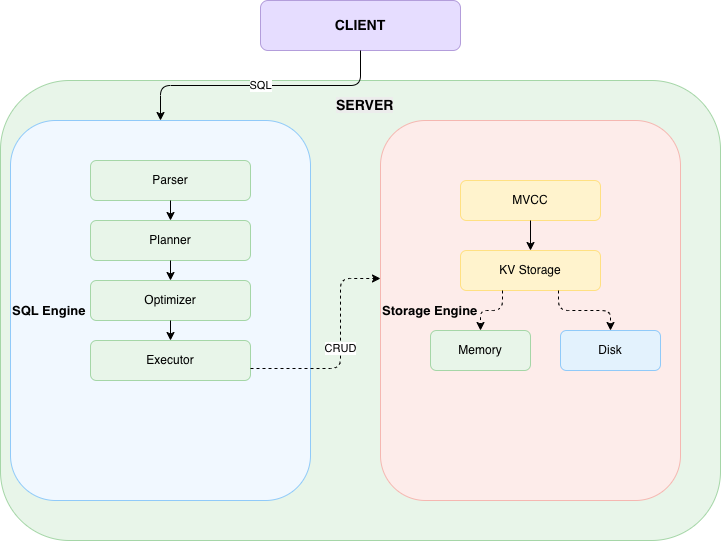

# RusticDB
A from-scratch, educational SQL database implementation written in Rust.
Implements core SQL features (parsing, execution, storage) for learning purposes.Inspired by roseduan.
Not production-ready, but a fully-functional tour of database internals.

If you like, please give me a star.



Currently, the storage engine is based on memory, and it is only natural to switch to a disk-based storage engine. During development, I implemented a simplified version of the Bitcask storage engine but did not commit it. Readers can consider implementing the Engine trait themselves to enable this SQL database to store data on disk. For beginners, they can implement Bitcask or BTree; for more advanced users, they can implement BPlusTree or LSM-Tree.
Later I will implement a BPlusTree storage engine.

All comments are generated by Claude Code. If there are any errors, please point them out.

## Updating...
Next one is "More support for SQL statements".

## Currently supported SQL statements
### 1. Create Table
```sql
CREATE TABLE table_name (
    [ column_name data_type [ column_constraint [...] ] ]
    [, ... ]
   );

   where data_type is:
    - BOOLEAN(BOOL): true | false
    - FLOAT(DOUBLE)
    - INTEGER(INT)
    - STRING(TEXT, VARCHAR)

   where column_constraint is:
   [ NOT NULL | NULL | DEFAULT expr ]
```

### 2. Insert Into
```sql
INSERT INTO table_name
[ ( column_name [, ...] ) ]
values ( expr [, ...] );
```

### 3. Select * From
```sql
SELECT * FROM table_name
[ORDER BY col_name [asc | desc] [, ...]]
[LIMIT count]
[OFFSET count]
```

### 4. Update
```sql
UPDATE table_name
SET column_name = expr [, ...]
[WHERE condition];

where condition is: `column_name = expr`
```

### 5. Delete
```sql
DELETE FROM table_name
[WHERE condition];

where condition is: `column_name = expr`
```